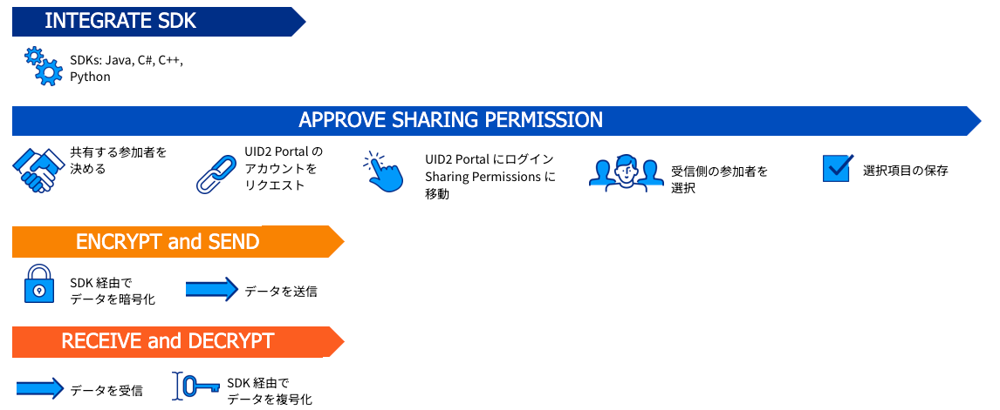

# UID2 Sharing: Overview 

<!-- It includes the following:

- [UID2 Sharing Workflow](#uid2-sharing-workflow)
- [Generating the Token for UID2 Sharing: Example](#creating-the-token-for-sharing-example)
- [Sharing in the Bid Stream](#sharing-in-the-bid-stream) -->

UID2 では、sharing とは UID2 参加者間で [raw UID2](../ref-info/glossary-uid.md#gl-raw-uid2) を安全に配布するためのプロセスです。未加工の UID2 を不正アクセスから保護するために、送信元の参加者 (送信者)は未加工の UID2 を暗号化して [UID2 Token](../ref-info/glossary-uid.md#gl-uid2-token) に変換してから送信しなければなりません。送信先の参加者(受信者)は、UID2 Token を内部で使用する raw UID2 に復号化しなければなりません。

UID2 の送信者は、UID2 Portal で権限を設定することで、自分の UID2 Token を復号できる受信者を指定します。送信者が受信者に UID2 sharing の許可を与えると、送信者の復号鍵が UID2 SDK を介して受信者と共有されます。sharing の一環として、UID2 SDK と API が暗号化と復号化の処理を行います。

例えば、広告主 (送信者) が、UID2 DSP である信頼できる sharing 参加者と raw UID2 を共有し、API 経由でセグメントを作成したいとします。sharing では、まず広告主が UID2 Potal を介して DSP に共有許可を与えます。次に広告主は、raw UID2 を UID2 Token に暗号化し、DSP (受信者)に安全に送信します。Sharing に参加している DSP も、 (UID2 Potal の共有許可設定を通じて)広告主の復号化キーにアクセスできるため、UID2 Token を復号化してセグメント作成のための raw UID2 に変換できます。

Sharing に参加するには、UID2 の送信者と受信者の両方がアカウントを作成する必要があります。アカウントがないと、UID2 参加者は UID2 Portal の共有参加者リストに表示されません。

Sharing には多くのシナリオがあります。その他の例については、[Sharing UID2s: Use Cases](sharing-use-cases.md) を参照してください。

>NOTE: パブリッシャーが UID2 Token をビッドストリームで共有するプロセスは、別のプロセスです。もしあなたが UID2 Token をビッドストリームに入れるパブリッシャーであれば、[Sharing in the Bid Stream](sharing-bid-stream.md) を参照してください。

その他のリソース:

- [Implementing Sharing](sharing-implementing.md)
- [UID2 Sharing: Best Practices](sharing-best-practices.md)
- [UID2 Portal: Overview](../portal/portal-overview.md)

## UID2 Sharing Workflow

UID2 参加者間で UID2 データを安全に共有するには、raw UID2 を UID2 Token に暗号化し、受信者が暗号化キーを使って復号化できるようにすることも含め、UID2 SDK または UID2 Snowflake インテグレーションを使用する必要があります。

UID2 sharing のワークフローは、ビッドストリームで UID2 Token を共有する場合を除くすべての共有者について、以下の手順で構成されます:

1. 送信側と受信側: 以下のいずれかを使用して、UID2 sharing とインテグレーションします:

   - sharing のための SDK: [Steps to Implement Sharing with an SDK](sharing-implementing.md#steps-to-implement-sharing-with-an-sdk) を参照してください。
   - sharing のための Snowflake インテグレーション: [Steps to Implement Sharing Using Snowflake](sharing-implementing.md#steps-to-implement-sharing-using-snowflake) を参照してください。

1. 送信者と受信者: UID2 Portal で共有許可を承認します:

   1. 送信者: 送信者の UID2 Token の復号化を許可する共有参加者を定義します。
   1. 送信者と受信者: UID2 Portal アカウントを要求します: [Request an Account](../portal/portal-getting-started.md#request-an-account) を参照してください。
   1. 送信者: UID2 Portal にログインし、共有許可ページに移動します。[Sharing Permissions](../portal/sharing-permissions.md) を参照してください。
   1. 送信者: 共有したい参加者を選択します。必要に応じて、検索機能を使用して特定の共有参加者を検索します。
   1. 送信者: 共有の選択を保存します。

1. 送信者: 以下の手順で UID2 を暗号化して送信します:

   1. UID2 SDK または Snowflake を使用して、raw UID2 を暗号化し、UID2 Token に変換します: [Sharing Steps: Summary](sharing-implementing.md#sharing-steps-summary) を参照してください。
   1. UID2 Token を認証された受信者に送信します。

1. 受信者: UID2 Token を復号化するには、以下の手順を実行します:

   1. UID2 Token を受信します。
   1. UID2 Token を復号化し、受信者が使用できる raw UID2 にします: [Sharing Steps: Summary](sharing-implementing.md#sharing-steps-summary) を参照してください。

以下の図は、UID2 sharing permission SDK の インテグレーションワークフローを示しています:

## Generating the Token for UID2 Sharing: Example

>Note: もしあなたがパブリッシャーであれば、[Token Example for Publishers in the Bid Stream](sharing-bid-stream.md#token-example-for-publishers-in-the-bid-stream) を参照してください。

UID2 共有者は、以下の例に示すように、2段階のプロセスを踏みます。手順は以下の通りです:
1. メールアドレスまたは電話番号を raw UID2 に変換します:

    入力されたメールアドレスまたは電話番号を raw UID2 に変換し、安全に保存できるようにします。

1. raw UID2 を UID2 Token に変換します:

    raw UID2 を暗号化して UID2 Token を作成し、信頼できる他の UID2 共有参加者と共有することができます。

<table>
<colgroup>
    <col style={{
      width: "30%"
    }} />
    <col style={{
      width: "40%"
    }} />
    <col style={{
      width: "30%"
    }} />
  </colgroup>
<thead>
<tr>
<th>Input Example</th>
<th>Process/User</th>
<th >Result</th>
</tr>
</thead>
<tbody>
<tr>
<td>user@example.com</td>
<td>メールアドレス/電話番号を raw UID2 に変換します: <a href="../endpoints/post-identity-map">POST&nbsp;/identity/map</a> endpoint</td>
<td>K2jlbu2ldlpKL1z6n5bET7L3 g0xfqmldZPDdPTktdRQ=</td>
</tr>
<tr>
<td>K2jlbu2ldlpKL1z6n5bET7L3 g0xfqmldZPDdPTktdRQ=</td>
<td>raw UID2 を暗号化して UID2 Token を作成します: encrypt() 関数を使用します。例えば Java の場合は、<a href="../sdks/uid2-sdk-ref-java#usage-for-uid2-sharers">Usage for UID2 Sharers</a> の step3 を参照してください。</td>
<td style={{
  wordBreak: "break-all"
}}>KlKKKfE66A7xBnL/DsT1UV/Q+V/r3xwKL89Wp7hpNllxmNkPaF8vdzenDvfoatn6sSXbFf5DfW9wwbdDwMnnOVpPxojkb8KYSGUte/FLSHtg4CLKMX52UPRV7H9UbWYvXgXC4PaVrGp/Jl5zaxPIDbAW0chULHxS+3zQCiiwHbIHshM+oJ==</td>
</tr>
</tbody>
</table>

## Sharing in the Bid Stream

パブリッシャーがビッドストリームで UID2 Token を共有するプロセスは、別のプロセスです。詳細は [Sharing in the Bid Stream](sharing-bid-stream.md) を参照してください。

## UID2 Token Pass-Through
UID2 Token は、元となる raw UID2 が同じであっても、そこから UID2 Token が生成されるたびにトークンの値が異なるように設計されています。つまり、UID2 Token は誰でも見ることができますが、復号鍵にアクセスできる UID2 参加者のみが使用できます。

例えば、UID2 Token は通常、ビッドストリームを通じてパブリッシャーから DSP に渡されます。UID2 Token は、SSP など複数の関係者を経由する可能性がありますが、UID2 Token を復号化できるのは UID2 参加者のみです。ビッドストリームを通過する際、UID2 Token は1つ以上の仲介者を安全に通過できます。

UID2 Sharing 参加者間のすべての共有シナリオで同じことが言えます。UID2 Token は、UID2 以外の参加者を経由して渡すことができます。
