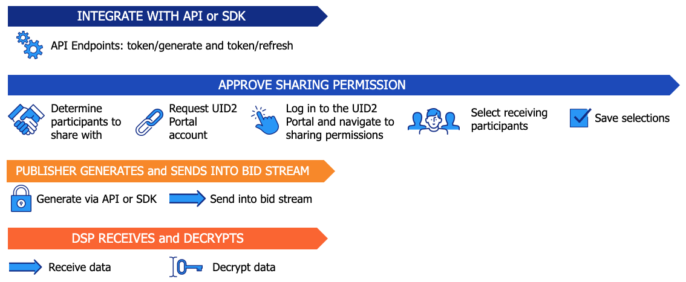

import Link from '@docusaurus/Link';

# Tokenized sharing in the bidstream

<Link href="../ref-info/glossary-uid#gl-bidstream">ビッドストリーム</Link>に共有される UID2 データは、[directly identifying information (DII)](../ref-info/glossary-uid.md#gl-dii) (メールアドレスまたは電話番号) を直接 UID2 Token に暗号化して生成された UID2 Token の形式でなければなりません。

パブリッシャーは、[implementation options](#implementation-options-for-senders) のいずれかを使用して DII を UID2 Token に暗号化し、UID2 Token をビッドストリームに送信できます。

他の共有参加者も、このトークン化された共有形態を使用する可能性があります。たとえば、広告主がトラッキングピクセル用の UID2 Token を作成するために使用するかもしれません。

:::caution
ビッドストリーム内のデータは不正にアクセスされる可能性があるため、raw UID2 をビッドストリームで共有することは決して許されません。ビッドストリームで共有する場合は、Tokenized Sharing が必要です。
:::

パブリッシャー向けの追加情報は以下のページにあります:
- [UID2 overview for publishers](../overviews/overview-publishers.md)
- [UID2 portal: Overview](../portal/portal-overview.md)

### Audience

ビッドストリームにおける Tokenized Sharing は、以下のオーディエンスに適用されます:

- **Sender**: パブリッシャー。UID2 Portal でのアカウント設定は任意です。
- **Receiver**: DSP. [Information for sharing receivers](#information-for-sharing-receivers) を参照してください。

### Implementation options for senders

DII を直接 UID2 Token に暗号化してビッドストリームに送信するには、以下の方法があります。

| Integration Option | Token Generated Client-Side or Server-Side? | Integration Guide |
| :--- | :--- | :--- |
| Prebid.js | Client-Side | [UID2 client-side integration guide for Prebid.js](../guides/integration-prebid-client-side.md) |
| Prebid.js | Server-Side | [UID2 client-server integration guide for Prebid.js](../guides/integration-prebid-client-server.md) |
| JavaScript SDK | Client-Side | [Client-side integration guide for JavaScript](../guides/integration-javascript-client-side.md) |
| JavaScript SDK | Server-Side | [Client-server integration guide for JavaScript](../guides/integration-javascript-client-server.md) |
| Java SDK | Server-Side | [SDK for Java reference guide](../sdks/sdk-ref-java.md) |
| Python SDK | Server-Side | [SDK for Python reference guide](../sdks/sdk-ref-python.md) |
| UID2 API (token generate and refresh) | Server-Side | [UID2 endpoints summary: UID2 tokens](../endpoints/summary-endpoints.md#uid2-tokens) | 

これらのオプションは、メールアドレスまたは電話番号から UID2 Token を生成し、トークンを定期的に更新することをサポートしています。他の SDK は、現時点ではトークン生成とトークン更新をサポートしていません。

:::tip
SDK に関する詳細は、[SDK functionality](../sdks/summary-sdks.md#sdk-functionality) を参照してください。パブリッシャー向けのインテグレーションアプローチの詳細は、[Publisher integrations](../guides/summary-guides.md#publisher-integrations) を参照してください。
:::

### Decryption options for receivers

UID2 Token の復号化には以下の方法があります。

   | Scenario | Link to Doc |
   | :--- | :--- |
   | Tokenized sharing from raw UID2s with SDK | [Implementing sharing encryption/decryption with an SDK](sharing-tokenized-from-raw.md#implementing-sharing-encryptiondecryption-with-an-sdk) |
   | Tokenized sharing from raw UID2s with Snowflake | [Implementing sharing encryption/decryption using Snowflake](sharing-tokenized-from-raw.md#implementing-sharing-encryptiondecryption-using-snowflake) |
   | Tokenized sharing in the bidstream from DII | [DSP integration guide](../guides/dsp-guide.md) |
   | Tokenized sharing in tracking pixels from DII | [Workflow: Tokenized sharing in tracking pixels](sharing-tokenized-from-data-pixel.md#workflow-tokenized-sharing-in-tracking-pixels) |
   | Tokenized sharing in creative pixels from raw UID2s | [Workflow: Tokenized sharing in creative pixels](sharing-tokenized-from-data-pixel.md#workflow-tokenized-sharing-in-creative-pixels) |

### Account setup in the UID2 portal

ビッドストリームで共有する場合、送信者は UID2 Portal アカウントを必要としません。どのパブリッシャーも、すべての DSP と共有できるように自動的に設定されます。ただし、パブリッシャーで共有範囲を限定したい場合は、UID2 Portal アカウントをリクエストし、共有権限を設定することができます。たとえば、セキュリティ上の理由やその他の理由で、1社または複数の共有パートナーに限定して共有したい場合などです。

すべての共有受信者は、UID2 Portal にアカウントを設定する必要があります。

送信者は、受信者または参加者のタイプごとに共有許可を1回だけ設定する必要があります。ただし、新しい共有権限を追加したり、既存の共有権限を変更したりする場合は、再度設定し直す必要があります。

詳細は [UID2 portal: Overview](../portal/portal-overview.md) を参照し、各タスクのリンクをたどってください。

### Workflow: Tokenized sharing in the bidstream

API または指定された Server-Side SDK を介して、DII から UID2 Token を生成するワークフローは、以下の手順で構成されます:

1. UID2 とのインテグレーションをセットアップします:

   - パブリッシャー: [Implementation options for senders](#implementation-options-for-senders) に記載されているいずれかの方法を使用します。

     オプションで、UID2 Token を復号化できる DSP を制限できます: UID2 Portal で共有権限を設定します。[Account setup in the UID2 portal](#account-setup-in-the-uid2-portal) を参照してください。
   - DSP: [Decryption options for receivers](#decryption-options-for-receivers) に記載されているインテグレーションオプションのいずれかを使用します。

1. パブリッシャーは以下の手順で UID2 Token を作成し、送信します:

   1. メールアドレスまたは電話番号から UID2 Token を生成します。
   1. UID2 Token をビッドストリームに送信します。

1. DSP は以下のステップを完了します:

   1. UID2 Token を受け取ります。
   1. UID2 Token を raw UID2 に復号します。
   1. UID2 がオプトアウトされていないことを確認します。詳細は [Honor user opt-outs](../guides/dsp-guide.md#honor-user-opt-outs) を参照してください。オプトアウトされていない場合は、raw UID2 を入札に使用します。

以下の図は、パブリッシャーのための UID2 共有ワークフローです。

### Token example for publishers in the bidstream

パブリッシャーは、次の例に示すように、入力されたメールアドレスまたは電話番号を直接 UID2 Token に変換し、ビッドストリームで使用します。

<table>
<colgroup>
    <col style={{
      width: "30%"
    }} />
    <col style={{
      width: "40%"
    }} />
    <col style={{
      width: "30%"
    }} />
   
  </colgroup>
<thead>
<tr>
<th>Input Example</th>
<th>Process/User</th>
<th >Result</th>
</tr>
</thead>
<tbody>
<tr>
<td>user@example.com</td>
<td>正規化されたメールアドレス/電話番号を UID2 Token に変換します: <a href="../endpoints/post-token-generate">POST&nbsp;/token/generate</a> エンドポイント NOTE: SDK を使用している場合は、SDK がトークン生成を管理します。</td>
<td style={{
  wordBreak: "break-all"
}}>KlKKKfE66A7xBnL/DsT1UV/Q+V/r3xwKL89Wp7hpNllxmNkPaF8vdzenDvfoatn6sSXbFf5DfW9wwbdDwMnnOVpPxojkb8KYSGUte/FLSHtg4CLKMX52UPRV7H9UbWYvXgXC4PaVrGp/Jl5zaxPIDbAW0chULHxS+3zQCiiwHbIHshM+oJ==</td>
</tr>
</tbody>
</table>

## Information for sharing receivers

UID2 Token を raw UID2 に復号するには、承認された共有参加者であり、送信者の暗号鍵を持っている必要があります。

デフォルトでは、パブリッシャーが UID2 Token をビッドストリームに送信する場合、パブリッシャーの暗号キーはすべての承認済み DSP と共有されます。ただし、パブリッシャーが特定の共有関係を設定している場合は、パブリッシャーが共有関係を作成している場合にのみ、そのパブリッシャーの暗号キーを受け取ることができます。

詳細は [Receiving UID2 tokens from another sharing participant](sharing-tokenized-overview.md#receiving-uid2-tokens-from-another-sharing-participant) を参照してください。

暗号鍵の更新を定期的に行い、UID2 Token を速やかに復号化することが重要です。

詳細は、*UID2 Sharing: Best Practices*の以下のセクションを参照してください:

- [Decryption key refresh cadence for sharing](sharing-best-practices.md#decryption-key-refresh-cadence-for-sharing)
- [Best practices for managing raw UID2s and UID2 tokens](sharing-best-practices.md#best-practices-for-managing-raw-uid2s-and-uid2-tokens)
