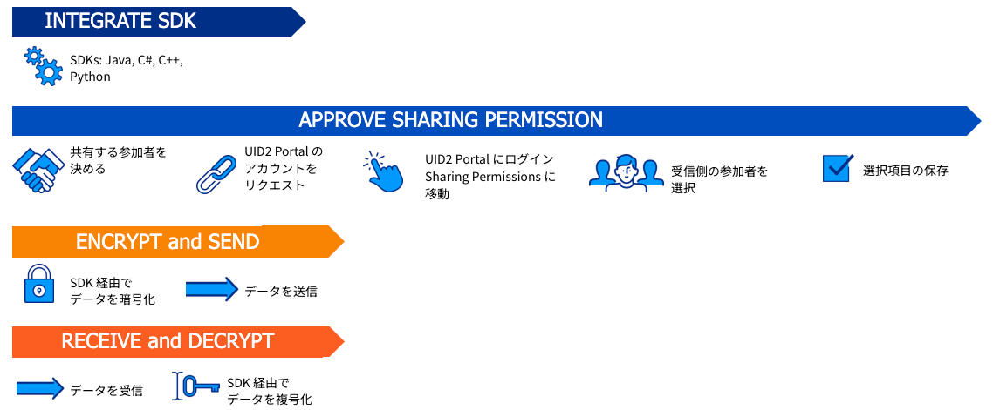

import Link from '@docusaurus/Link';

# Tokenized Sharing from Raw UID2s

いくつかのケースでは、共有参加者が raw UID2 を他の共有参加者に送信する前に、それらを暗号化したい場合があります。広告主がクリエイティブピクセルで UID2 を共有する場合がその一例です。

### Audience

raw UID2 からの Tokenized sharing は、ユースケースによっては、どの共有参加者にも適用可能です。

## Overview

送信前に UID2 Token に暗号化して raw UID2 を別の参加者と共有するには、共有送信者は UID2 Portal アカウントを作成して共有を実装し、受信者と共有関係を作成する必要があります。

共有受信者は、UID2 Portal アカウントを作成して共有を実装し、送信者と共有関係を持つ必要があります。

## Account Setup in the UID2 Portal

UID2 Portal では、送信者と受信者はアカウントを設定し、送信者は共有権限を設定する必要があります。

送信者は、受信者または参加者のタイプごとに共有許可を1回だけ設定する必要があります。ただし、新しい共有権限を追加したり、既存の共有権限を変更したりする場合は、再度設定し直す必要があります。

詳細は [UID2 Portal: Overview](../portal/portal-overview.md) を参照し、各タスクのリンクをたどってください。

## Tokenized Sharing Steps: Summary

raw UID2 から UID2 Token を生成して共有する手順を以下に説明します:

1. すべてのユーザーはアカウントを設定し、共有オプションを構成する必要があります。[Account Setup in the UID2 Portal](#account-setup-in-the-uid2-portal) を参照してください。

2. コードに共有を実装するには、以下から選択してください。選択肢は、使用しているインテグレーションオプションによって異なります:

   - [Implementing Sharing Encryption/Decryption with an SDK](#implementing-sharing-encryptiondecryption-with-an-sdk)
   - [Implementing Sharing Encryption/Decryption Using Snowflake](#implementing-sharing-encryptiondecryption-using-snowflake)

## Workflow: Tokenized Sharing from Raw UID2

raw UID2 から UID2 Token を生成して、Tokenized Sharing を行うワークフローは、以下の手順で構成されています。

:::note
送信者と受信者の両方が UID2 Portal アカウントを持っている必要があります。[Request an Account](../portal/portal-getting-started.md#request-an-account) を参照してください。
:::

1. 送信者と受信者: [UID2 SDK](sharing-tokenized-from-raw.md#implementing-sharing-encryptiondecryption-with-an-sdk) または [Snowflake](sharing-tokenized-from-raw.md#implementing-sharing-encryptiondecryption-using-snowflake) を使用して UID2 Sharing をインテグレーションします。

1. 送信者: UID2 Portal で共有権限を承認します:

   1. UID2 Token を復号することを許可する共有参加者を定義します。
   1. UID2 Portal にログインし、[Sharing Permissions](../portal/sharing-permissions.md) ページに移動し、共有したい参加者を指定します。必要に応じて、特定の共有参加者を検索するために検索機能を使用します。
   1. 共有選択肢を保存します。

1. 送信者: UID2 Token に変換するために raw UID2 を暗号化します。これには、[UID2 SDK](sharing-tokenized-from-raw.md#implementing-sharing-encryptiondecryption-with-an-sdk) または [Snowflake](sharing-tokenized-from-raw.md#implementing-sharing-encryptiondecryption-using-snowflake) を使用します。

   -  UID2 Token を安全に受信者に送信します。

1. 受信者: UID2 Token を復号化するために以下の手順を完了します:
   
      1. UID2 Token を安全に受信します。
      1. UID2 Token を raw UID2 に復号化します: [Implementing Sharing Encryption/Decryption with an SDK](sharing-tokenized-from-raw.md#implementing-sharing-encryptiondecryption-with-an-sdk) または [Implementing Sharing Encryption/Decryption Using Snowflake](sharing-tokenized-from-raw.md#implementing-sharing-encryptiondecryption-using-snowflake) を参照してください。

次の図は、UID2 Sharing Permission SDK インテグレーションワークフローを示しています:

## Implementing Sharing Encryption/Decryption with an SDK

以下の手順は、SDK を使用して raw UID2 を UID2 Token に暗号化するか、UID2 Token を raw UID2 に復号化するすべての共有参加者に適用されます。&#8212;送信者と受信者。

1. 使用する SDK を決定し、以下の選択肢から適用する共有ドキュメントの例を確認して、共有コードがどのように見えるかを確認します。

   | SDK/Integration Tool | Link to Sharing Section |
   | :--- | :--- | 
   | C# / .NET | [SDK for C# / .NET: Usage for UID2 Sharers](../sdks/sdk-ref-csharp-dotnet.md#usage-for-uid2-sharers) |
   | C++ | [SDK for C++: Usage for UID2 Sharers](../sdks/sdk-ref-cplusplus.md#usage-for-uid2-sharers) |
   | Java | [SDK for Java: Usage for UID2 Sharers](../sdks/sdk-ref-java.md#usage-for-uid2-sharers) |
   | Python | [SDK for Python: Usage for UID2 Sharers](../sdks/sdk-ref-python.md#usage-for-uid2-sharers) |

2. 以下の手順に従って、SDK をコードに組み込み、送信者または受信者の役割に応じて各ステップを実装します。使用している言語のコード例を確認するには、以下の表のリンクを参照してください。
   1. 送信者と受信者: UID2 Client を定義します。
   
   2. 送信者と受信者: 暗号鍵の更新スケジュールを定義します。
   
      推奨される更新間隔は1時間です。例については、[Decryption Key Refresh Cadence for Sharing (SDK Only)](#decryption-key-refresh-cadence-for-sharing-sdk-only) を参照してください。

   3. 送信者: 暗号化を設定します。

   4. 受信者: 復号化を設定します。

### Decryption Key Refresh Cadence for Sharing (SDK Only)

SDK を使用している場合、共有キーの更新スケジュールを定義することもStep 2の一部です。

長時間/継続的に実行されるプロセスでは、1時間に1回 `uid2client.refresh()` 関数を呼び出すことを推奨します。

詳細は [Decryption Key Refresh Cadence for Sharing](sharing-best-practices.md#decryption-key-refresh-cadence-for-sharing) の *UID2 Sharing: Best Practices*　を参照してください。

:::note
Snowflake を使用している場合は、この手順を実行する必要はありません。Snowflake UID2 インテグレーションがキーのリフレッシュを行います。
:::

### Decryption Key Refresh Example

この例は、`uid2client.refresh()` 関数が新しい共有許可を有効にする方法を示しています。この例では、広告主 ABC がデータプロバイダ XYZ にデータを送信したいとします。

| Time | Event |
| :--- | :--- |
| 12:00 pm | 共有権限がまだ有効になっていません。 データプロバイダ XYZ が `uid2client.refresh()` を呼び出します。広告主 ABC の復号鍵が返されないため、データプロバイダ XYZ は UID2 Token を復号化できません。 |
| 12:30&nbsp;pm | 広告主 ABC が UID2 Portal にログインし、データプロバイダ XYZ との共有許可を作成します。 |
| 1:00 pm | データプロバイダ XYZ は、1時間ごとに `uid2client.refresh()` を再度呼び出します。新しい共有許可があるため、広告主 ABC の鍵が応答に返されます。 データプロバイダ XYZ は、広告主 ABC から受け取った UID2 Token を復号化して raw UID2 に変換できます。 |

## Implementing Sharing Encryption/Decryption Using Snowflake

Snowflake を使用している UID2 参加者は、送信者または受信者として UID2 Sharing に参加することができます。

1. [Snowflake Integration Guide: Usage for UID2 Sharers](../guides/snowflake_integration.md#usage-for-uid2-sharers) の例を確認して、共有コードがどのように見えるかを確認します。

2. 送信者または受信者の役割に応じて、コードに Snowflake を組み込みます。以下のドキュメントにあるコード例を使用してください: [UID2 Sharing Example](../guides/snowflake_integration.md#uid2-sharing-example):

   - 送信者: 暗号化を設定します。
   - 受信者: 復号化を設定します。

## Information for Sharing Receivers

UID2 Token を raw UID2 に復号化するには、UID2 Portal アカウントが必要であり、送信者があなたとの共有関係を作成する必要があります。

詳細については、[Receiving UID2 Tokens from Another Sharing Participant](sharing-tokenized-overview.md#receiving-uid2-tokens-from-another-sharing-participant) を参照してください。

暗号鍵を定期的に更新し、UID2 Token をすみやかに復号化することが重要です。

詳細については、*UID2 Sharing: Best Practices* の次のセクションを参照してください:

- [Decryption Key Refresh Cadence for Sharing](sharing-best-practices.md#decryption-key-refresh-cadence-for-sharing)
- [Best Practices for Managing Raw UID2s and UID2 Tokens](sharing-best-practices.md#best-practices-for-managing-raw-uid2s-and-uid2-tokens)
