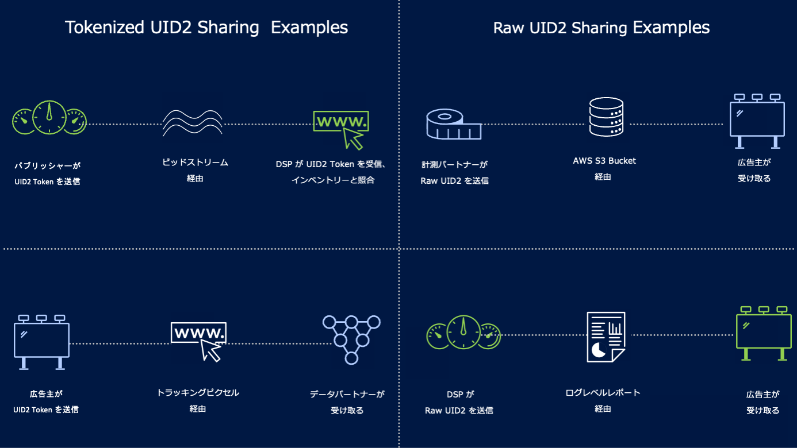

import Link from '@docusaurus/Link';

# Sharing UID2s: Use Cases

安全な共有ワークフローでは、信頼できる参加者と UID2 をさまざまな方法で共有できます。ルートによっては、raw UID2 か UID2 Token を送ることができます。

例として、送信者が raw UID2 や UID2 Token を受信者と共有したい場合のシナリオをいくつか挙げます:

- Tokenized Sharing (sharing a UID2 token) examples:
  - パブリッシャー (送信者) は、UID2 Token を<Link href="../ref-info/glossary-uid#gl-bidstream">ビッドストリーム</Link>経由で DSP (受信者) に送信します。([Tokenized Sharing in the Bidstream](sharing-tokenized-from-data-bid-stream.md) を参照)
  - 広告主 (送信者) がトラッキングピクセルを通じて UID2 Token をデータプロバイダー (受信者) に送信します。([Tokenized Sharing in Pixels](sharing-tokenized-from-data-pixel.md) を参照)
- Raw UID2 共有 (sharing a raw UID2) の例:
  - 測定パートナー (送信者) は、Amazon Simple Storage Service (S3) を介して、raw UID2 を広告主 (受信者) に送信します。([Raw UID2 Sharing](sharing-raw.md) を参照)
  - DSP (送信者) は、raw UID2 をレポート経由で広告主 (受信者) に送信します。([Raw UID2 Sharing](sharing-raw.md) を参照)

これらのシナリオと、その他のシナリオを以下の図に示します。

