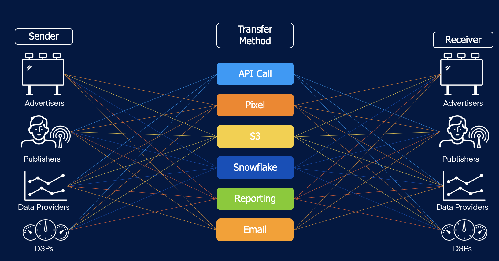

import Link from '@docusaurus/Link';

# Sharing UID2s: Use Cases

The secure sharing workflow allows you to share UID2s with trusted participants in many different ways. Depending on the route, you might send either raw UID2s or UID2 tokens.

For example, here are some scenarios where a sender wants to share raw UID2s or UID2 tokens with a receiver:

- Tokenized sharing (sharing a UID2 token) examples:
  - A publisher (sender) sends a UID2 token via the bid stream to a DSP (receiver) (see [Tokenized Sharing in the Bid Stream](sharing-tokenized-from-data-bid-stream.md)).
  - An advertiser (sender) sends a UID2 token to a data provider (receiver) via a tracking pixel (see [Tokenized Sharing in Pixels](sharing-tokenized-from-data-pixel.md)).
- Raw UID2 sharing (sharing a raw UID2) examples:
  - A measurement partner (sender) sends a raw UID2 to an advertiser (receiver) via Amazon Simple Storage Service (S3) (see [Raw UID2 Sharing](sharing-raw.md)).
  - A DSP (sender) sends a raw UID2 to an advertiser (receiver) via reporting (see [Raw UID2 Sharing](sharing-raw.md)).

<!-- These scenarios, and others, are represented in the following diagram. -->

<!-- (**GWH_KL note Kimberly is working with Marketing to redo this diagram.**) -->

<!--  -->
