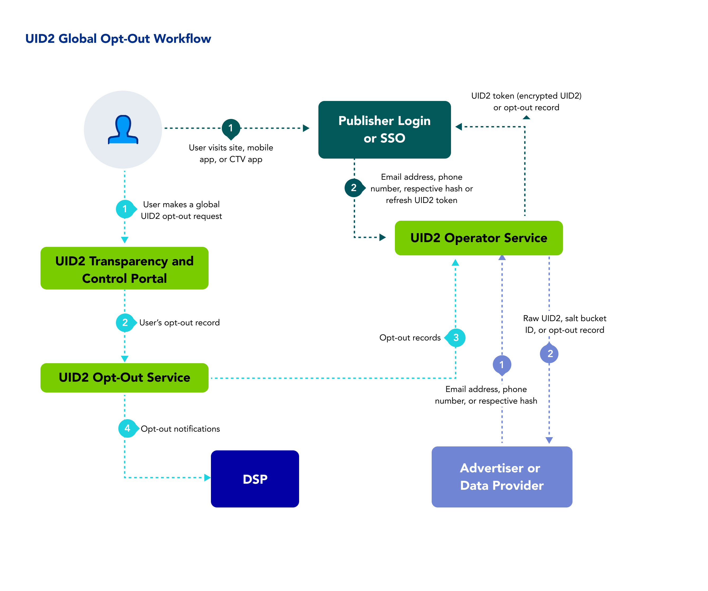

以下のステップは、パブリッシャーまたはその ID プロバイダーと関わるユーザーを対象とした、ワークフローの概要を提供します。

1. ユーザーは[Transparency and Control Portal](https://www.transparentadvertising.com/)にアクセスし、そこで UID2 のオプトアウトをグローバルに行えます。
2. Transparency and Control Portal は、オプトアウトリクエストを UID2 [Operator Service](../ref-info/glossary-uid.md#gl-operator-service)に送信します。
3. ユーザーがオプトアウトした場合、UID2 Operator Service は、以下のようにオプトアウト情報を UID2 参加者に配布します:

   | Participant | Distribution Method |
   | :--- | :--- | 
   | Publishers | パブリッシャーが必須の `optout_check` パラメータを `1` に設定して [POST /token/generate](../endpoints/post-token-generate.md) あるいは [POST /token/refresh](../endpoints/post-token-refresh.md) を呼び出すと、UID2 Token の代わりにオプトアウトレスポンスを受け取ります。 |
   | DSPs | UID2 Operator Service は、この目的のために提供される Webhook を介して、すべてのオプトアウト済みユーザーの情報を DSP に配信します。詳細については、[Honor User Opt-Outs](../guides/dsp-guide#honor-user-opt-outs)を参照してください。 |
   | Advertisers | UID2 Operator Service は、[POST /identity/map](../endpoints/post-identity-map.md) エンドポイントを介して、オプトアウト情報を広告主に配布します。 |

このワークフローでは、ユーザーが UID2 識別子の作成に同意し、透明性と管理ポータルを通じて UID2 の同意とプライバシー設定を管理できます。

<!-- 3. If the user has opted out, the UID2 Operator Service distributes the opt-out information to various UID2 participant types, as follows:
   - **Publishers**: A publisher calling  the [POST /token/generate](../endpoints/post-token-generate.md) or [POST /token/refresh](../endpoints/post-token-refresh.md) endpoint receives the opt-out response. At this point, there is no longer a valid UID2 token for that user.
   - **DSPs**: The UID2 Operator Service distributes information on all opted-out users to DSPs via a webhook provided for the purpose. For details, see [Honor User Opt-Outs](../guides/dsp-guide#honor-user-opt-outs).
   - **Advertisers**: The UID2 Operator Service distributes opt-out information to advertisers via the [POST /identity/map](../endpoints/post-identity-map.md) endpoint.
 -->