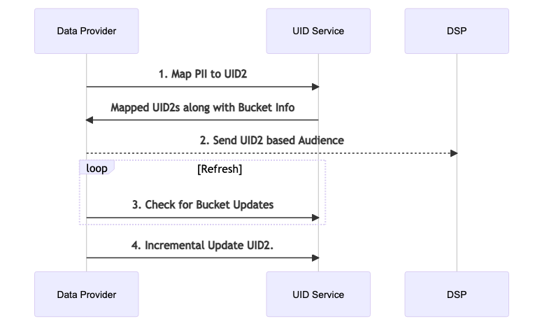

[UID2 Documentation](../../README.md) > v1 > Integration Guides > Advertiser/Data Provider Integration Guide

# Overview

Following are the steps that Data Providers/Advertisers can take to map PII to UID2 for targeting and audience building purposes. 

Note: PII refers to email address or SHA256 of normaled email address.




# Steps

## 1 Map PII to UID2

Use the [/identity/map](../endpoints/post-identity-map.md) endpoint to map PII to UID2. The UID2 thus returned can be used to target audiences on relavant DSPs and for other use cases.

## 2 Send UID2 based Audience
This will be a DSP specific endpoint/mechanism and is out of scope for this document. Follow DSP specific Integration for sending UID2 based audience.

## 3 Check for Bucket Updates

By it's very design, the UID2 is an id for a user at a particular moment in time. A user's UID2 can and will rotate once a year. One can choose to either blanketly update their segments on daily basis or can implement incremental updates by querying bucket rotation status.

Bucket status endpoint [/identity/buckets](../endpoints/get-identity-buckets.md) can return the buckets that have their associated UID2s rotated since a given timestamp.

## 4 Incremental Update UID2

Leveraging Steps 1 and 3, a system can continously update its UID2 based audiences to the DSP. The response from Step 1 contains mapped UID2 and corresponding "bucket_id" associated with it. While UID2 can rotate, the bucket_id will stay constant for the given user.

From Step 1. the system can store the Mapping between PII and Bucket ID along with last updated timestamp. e.g.

```
PIIIdentifier, BucketId, Updated Timestamp
```

By querying the Bucket info described in Step 3, the system can repeat step 1 and 2 for the UIDs associated with the updated buckets.

# Frequently Asked Questions
### Q: How does a holder of UID2 know when to refresh the UID2 due to salt rotation?
Metadata supplied with the UID2 generation request indicates the salt bucket used for generating the UID2. Salt buckets are persistent and correspond to the underlying PII. Use the API provided to return which salt buckets rotated since a given timestamp. The returned rotated salt buckets inform the UID2 holder which UID2s to refresh. This workflow typically applies to data providers. 

### Q: How often should IDs be refreshed for incremental updates?
The recommended cadence for updating audiences is daily. 

### Q: How should i generate the SHA256 of PII for mapping?
The system should follow the email normalization rules (described in the [Overview document](../../README.md)) and hash without salting. The value needs to be base64 encoded before it can be sent.


