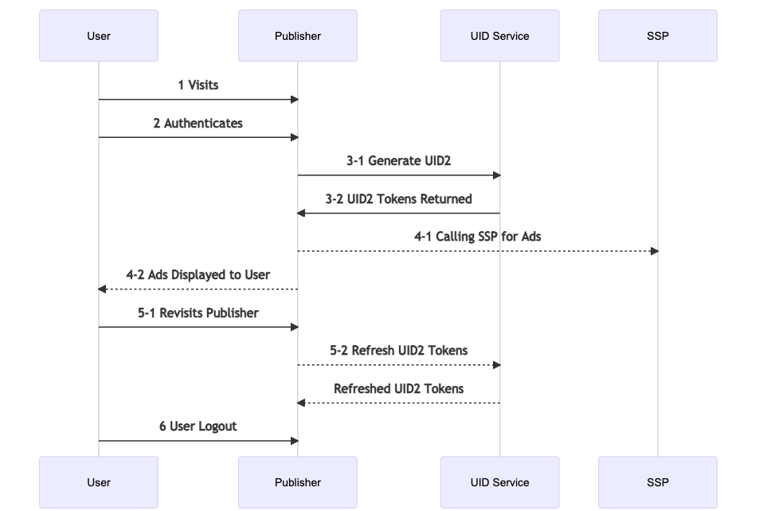

[UID2 Documentation](../../README.md) > v1 > [Integration Guides](README.md) > Custom Publisher Integration Guide 

# Overview

The following integration workflow is the lifecycle for a user establishing a UID2 token with a publisher and how the UID2 token integrates with the RTB bid stream.




## Integration Steps

Publisher-specific workflows are covered in steps 3-1, 4-1, 5-2, and 6.

## 3-1. Generate a UID2 token for an authenticated user.

There are two ways for publishers to establish an identity for a user with UID2. The first way is to integrate with a UID2-enabled single-sign-on provider. The second way is for a publisher to generate UID2 tokens themselves.

This article focuses on publishers who want to generate UID2 tokens themselves.

Publishers can generate a UID2 identity token when a user authenticates using the  [GET /token/generate](../endpoints/get-token-generate.md) endpoint. The request includes a user's normalized email address or the base64-encoded SHA256 hash of the user's normalized email address. See Normalization rules [here](../../README.md#emailnormalization). The returned ```advertising_token``` and ```refresh_token``` should be placed in a store tied to the user, like a first-party cookie or server-side storage. Later steps use these tokens.

## 4-1. Use a UID2 token to query an SSP for relevant ads.
The Publisher needs to pass the ```advertising_token``` returned from step 3-1 to the SSP for RTB purposes. The value should be sent as-is.

## 5-2. Refresh UID2 identity token.

Leverage the refresh endpoints to retrieve the latest version of UID2 tokens. UID2 token refreshes are required to sync a user's UID2 rotation and opt-out status. If a user opts out, using their refresh token will end their token refresh chain.

We recommend refreshing active user identity tokens every 5 minutes. 

If an inactive user becomes active again (returned to the site), we recommend refreshing the identity token before sending it through for bidding.

There is no need to refresh tokens for inactive users.

Refresh UID2 tokens by using the ```refresh_token``` from step 3-1 as a query parameter in the [GET /token/refresh](../endpoints/get-token-refresh.md) endpoint.

## 6. Clear user identity.
Once a user logs out, remove the UID2 tokens stored for that user.  No interaction with UID service is required.

# Frequently Asked Questions

### Do I need to decrypt tokens?
No, publishers do not need to decrypt tokens.

### How will I be notified of user opt-out?
The token refresh process handles user opt-outs. Using their refresh token automatically clears their session and disrupts their ```refresh_token``` chain when a user opts out. No manual action is required. 

### What is the uniqueness and rotation policy for UID2 token?

The UID2 service encrypts tokens using random initialization vectors. The encrypted UID2 is unique for a given user as they browse the internet. At every refresh, the token re-encrypts. This mechanism ensures that untrusted parties cannot track a user's identity.