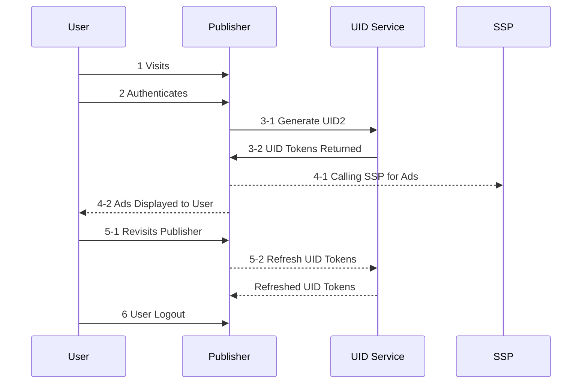

[UID2 Documentation](../../README.md) > v1 > Integration Guides > Custom Publisher Integration Guide 

# Overview

Following is the Lifecycle for User establishing UID2 on publisher and how it integrates with RTB.

### Steps

Steps 3-1, 4-1, 5-2, 6 are integration points for Publisher

## 3-1 Generate UID2

The publisher calls the token generation endpoint [/token/generate endpoint](../endpoints/get-token-generate.md) for the user by providing either there email address or SHA256 hash of it. The returned tokens should be stored in a store tied to the User (e.g. First Party cookie, or Server side storage) as publisher sees fit.

## 4-1 Calling SSP for Ads
The Publisher needs to pass the "advertising_token" part of the UID Tokens payload (from step 3-1) to the SSP for RTB Purposes. The value needs to be passed as is.

## 5-2 Refresh UID2
Upon user returning to the site or elapsed time has passed (Recommended 5 minutes). The Publisher needs to refresh the UID2 tokens for the User. 
The UID Tokens can be refreshed by passing the "refresh_token" part of the UID Tokens (from step 3-1) to the [/token/refresh endpoint](../endpoints/get-token-refresh.md). Refreshing the tokens is necessary to sync user's optout and rotating Id in the background. After refresh, the Publisher should store new set of tokens as done in step 3-1.

## 6 User Logout
Publisher should remove the UID Tokens stored for that user. No interaction with UID Service is required.

# Frequently Asked Questions
### Q: How often should the tokens be refreshed?
The tokens should be refreshed at cadence of 5 min upon user returning to the Publisher.

### Q: Do i need to decrypt any of the Tokens?
No, Publisher does not need to decrypt any tokens.

### Q: How will i be notified of user optout?
User optouts are encompassed as part of token refreshing. No more action needs to be take.

### Q: What is the uniquess and rotation policy for UID2 Token.
The tokens are encrypted using randmon initialization vectors, so the encrypted payload will look different for user as the browse through the internet. The token also gets reencrypted on every refresh. The intentof the mechanism is that person is not trackable by the tokens as they browse the internet.

