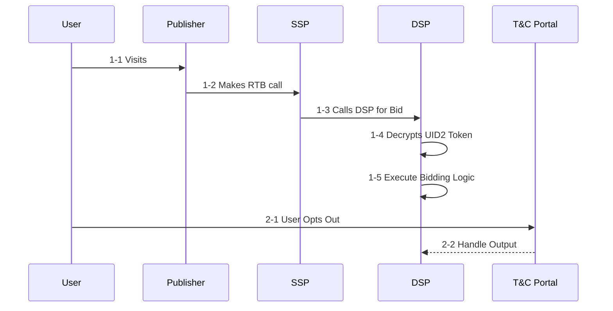
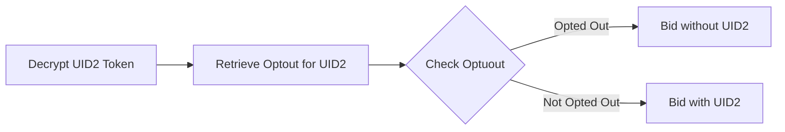

[UID2 Documentation](../../README.md) > v1 > Integration Guides > DSP Integration Guide

# Overview

The following describe the Integration for DSP to supporting UID2 for RTB.

The DSP has to integrate two use cases:
1. Decrtypting UID2 on RTB Requests
2. Honoring Optout for the User.

Note: The relevant use case steps are prefixed with the relevant number in the diagram below


Note: T&C Portal refers to Transperancy and Control Portal

### Steps

Step 1-4 and Step 2-2 are integration points for DSP to implement. 

## 1-4 Decrypting UID2 Token

The DSP should leverage the provided [SDK](../sdks/dsp-client-v1-overview.md) to decrypt the incoming UID2 Token. Library response will contain the UID2 and the timestamp that user session was established. The DSP is required to check against the most recent opt out timestamp for that UID2 (if it exists) to honor opt out. Following describes the logic.



Following should be the logic for <b>Check Optout</b> step described above:
```code
if (established_timestamp < optout_timestamp) {
  // Opted out
}
```

## 2-2 Handle Optout

The DSP will get called back on configured URL when a User opts out from Privacy Portal. The DSP should record the opt out timestamp for the corresponding ID, to be later used in bidding purposes (see above).

The callback will contain the following two pieces of information

| Parameter | Description |
| --- | --- |
| identity | UID2 for the user opting out |
| timestamp | Time at which the User opted out |


# Frequently Asked Questions
### Q: How do companies interfacing with UID2 tokens know which decryption key to apply?  
Updating decryption keys is handled automatically by the provided SDK. Metadata supplied with the UID2 token discloses the timestamp of encryption, which informs which decryption key applies. 

### Q: Where do i get the decrypting keys?
Ans: The library will talk to the UID Service in the background and periodiclly fetch the uptodate keys.


