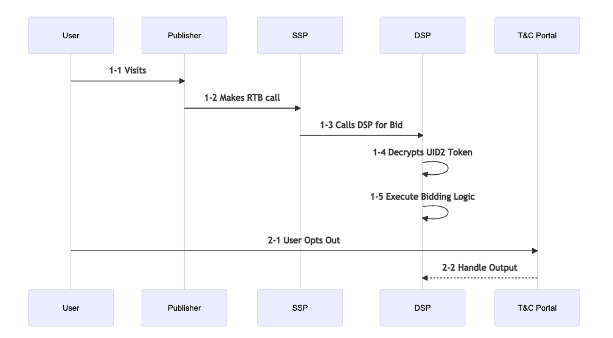

[UID2 Documentation](../../README.md) > v1 > [Integration Guides](README.md) > DSP Integration Guide

# Overview

The following describes the integration workflow for DSP to support UID2 as part of RTB.

There are two components for DSP integrations.
1. Decryp UID2 tokens to use in RTB.
2. Honor user opt-outs.



Note: T&C Portal refers to Transperancy and Control Portal

# Integration Steps 

## 1-4 Decrypt UID2 tokens to use in RTB.
These integration steps correspond to diagram area 1-4.

Leverage the provided [SDK](../sdks/dsp-client-v1-overview.md) to decrypt incoming UID2 tokens. The response contains the UID2 and the UID2 creation time (```established_timestamp```). DSPs are required to check the most recent opt-out timestamp (```optout_timestamp```) for a UID2 and honor the opt-out. The following diagram illustrates opt-out logic.


The logic for the <b>check opt-out</b> step is:
```code
if (established_timestamp < optout_timestamp) {
  // Opted out
}
```
## 2-2 Honor user opt-outs.

DSPs establish a pre-configured URL or endpoint for the UID2 service to send opt-outs generated by users through the Transparency and Control Portal. When the UID2 service calls the configured interface, it should record the opt-out timestamp for the corresponding UID2. 

The callback will contain the following data.

| Parameter | Description |
| --- | --- |
| ```identity``` | The UID2 for the user who opted out |
| ```timestamp``` | The time when the user opted out |


# Frequently Asked Questions
### How do I know which decryption key to apply to a UID2?
Updating decryption keys is handled automatically by the provided [DSP SDK](../sdks/dsp-client-v1-overview.md). Metadata supplied with the UID2 token discloses the timestamp of encryption, which informs which decryption key applies. 

### Where do I get the decryption keys?
The [DSP SDK](../sdks/dsp-client-v1-overview.md) library communicates with the UID2 service in the background and periodically fetches the latest keys.