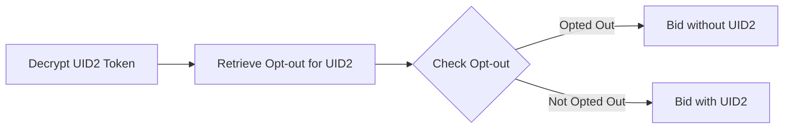

[UID2 Documentation](../../README.md) > v1 > Integration Guides > DSP Integration Guide

# Overview

The following describes the integration workflow for DSP to support UID2 as part of RTB.

The DSP has to integrate two use cases:
1. Decrypting UID2 on RTB Requests.
2. Honoring opt-out for the User.


Note: T&C Portal refers to Transperancy and Control Portal

### Steps

Step 1-4 and Step 2-2 are integration points for DSP to implement. 

## 1-4 Decrypting UID2 Token

The DSP should leverage the provided [SDK](../sdks/dsp-client-v1-overview.md) to decrypt the incoming UID2 Token. Library response will contain the UID2 and the timestamp that identity was established (established_timestamp). The DSP is required to check against the most recent opt-out timestamp (optout_timestamp) for that UID2 (if it exists) to honor opt out. Following describes the logic.



The logic for <b>Check Opt-out</b> step is:
```code
if (established_timestamp < optout_timestamp) {
  // Opted out
}
```

## 2-2 Handle Opt-out

The DSP will get a call-back on a pre-configured URL when a User opts out from the T&C Portal. The DSP should record the opt out timestamp for the corresponding UID2, to be later used for bidding (see above).

The callback will contain the following two pieces of information

| Parameter | Description |
| --- | --- |
| identity | UID2 for the user opting out |
| timestamp | Time at which the user opted out |


# Frequently Asked Questions
### Q: How do companies interfacing with UID2 tokens know which decryption key to apply?  
Updating decryption keys is handled automatically by the provided SDK. Metadata supplied with the UID2 token discloses the timestamp of encryption, which informs which decryption key applies. 

### Q: Where do I get the decrypting keys?
The library will talk to the UID Service in the background and periodically fetch the up-to-date keys.


