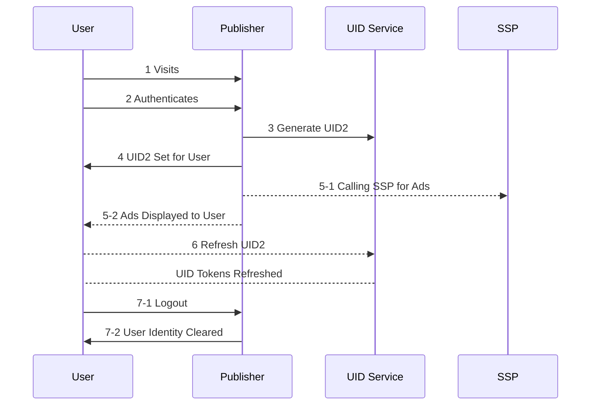

[UID2 Documentation](../../README.md) > v1 > Integration Guides > Publisher Integration Guide

# Overview

Following is the Lifecycle for User establishing UID2 on publisher and how it integrates with RTB.



### Steps 

Steps 3, 4, 5-1, 6, 7-2 are integration points for Publisher.

## 3 Generate UID2

Identitfy tokents can be established either by using a UID2 Enabled SSO or for Publisher to generate Identity themself via  [/token/generate endpoint](../endpoints/get-token-generate.md)  as part of user authentication.

## 4 UID Set for User

Once UID2 Tokens are returns from step above, they should be passed on to the [UID2 Client Library](../sdks/client-side-identity-v1.md) using the mechanism below. This ensures that UID2 Tokens are available for the user until they logout.

```java
<script>
  __uid2.init({
                                identity : <Response from the generate token api>
  });
</script>
```

## 5-1 Calling SSP for Ads

Once established, the identity is available for client to use for RTB purposes. The following snippet gives access to the identity that can be passed to SSPs.

```java
<script>
__uid2.getAdvertisingToken();
</script>
```

## 6 Refresh UID2
UID2 Tokens are refreshed automatically by the client side library and no action needs to be taken. This is mentioned for informative purposes only.

## 7-2 User Identity Cleared

It is impotant to remove user Identity from the property when user logouts or de-authenticates. Use the following to clear User Identity

```java
<script>
__uid2.disconnect();
</script>
```

# Frequently Asked Questions
### Q: How will i be notified of user optout?
User optouts are encompassed as part of token refreshingi which is automatically handled by the Client Side SDK. No more action needs to be taken.

