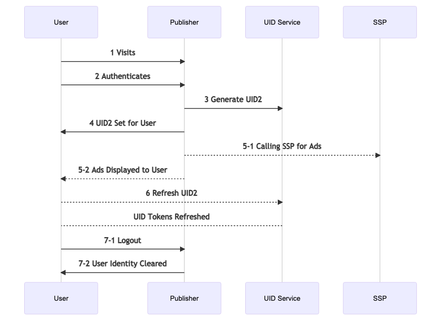

[UID2 Documentation](../../README.md) > v1 > Integration Guides > Publisher Integration Guide

# Overview

Following is the Lifecycle for User establishing UID2 on publisher and how it integrates with RTB.



### Steps 

Steps 3, 4, 5-1, 6, 7-2 are integration points for Publisher.

## 3 Generate UID2

Identity tokens can be established either by using a UID2 Enabled SSO or for Publisher to generate Identity themselves via  [/token/generate](../endpoints/get-token-generate.md) endpoint as part of user authentication.

## 4 UID Set for User

Once UID2 tokens are returned from the step above, they should be passed on to the [UID2 Client Library](../sdks/client-side-identity-v1.md) using the mechanism below. This ensures that UID2 tokens are available for the user until they logout.

```html
<script>
  __uid2.init({
     identity : <Response from the generate token api>
  });
</script>
```

## 5-1 Calling SSP for Ads

Once established, the identity is available for client to use for RTB purposes. The following snippet gives access to the identity that can be passed to SSPs.

```html
<script>
   __uid2.getAdvertisingToken();
</script>
```

## 6 Refresh UID2
UID2 Tokens are refreshed automatically by the [UID2 Client Library](../sdks/client-side-identity-v1.md) and no action needs to be taken. This is mentioned for informational purpose only.

## 7-2 User Identity Cleared

It is impotant to remove UID2 tokens from the user's storage when they logout. Use the following snippet to cleare out UID2 tokens.

```html
<script>
   __uid2.disconnect();
</script>
```

# Frequently Asked Questions
### Q: How will I be notified of user optout?
User opt-outs are handled as part of token refresh process, which is automatically handled by the [UID2 Client Library](../sdks/client-side-identity-v1.md). No integration action is neeeded.

