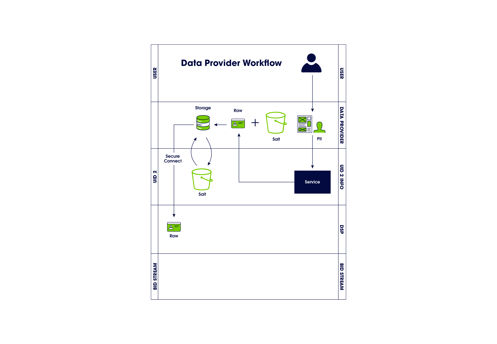

[UID2 Overview](../README-ja.md) > Third-Party Data Provider Workflow

# Third-Party Data Provider Workflow Overview

以下のステップは、ユーザーデータを収集し DSP にプッシュする組織（広告主、ID グラフプロバイダー、サードパーティデータプロバイダーなど）を対象としたワークフローのアウトラインを提供するものです。

1. データプロバイダーが、同意を得たユーザーの個人識別情報 (PII) を UID2 Operator に送信します。
2. UID2 Operator は raw UID2 を生成して返します。
3. データプロバイダーは UID2 とソルトバケットを保管します。 
   サーバーサイド: データプロバイダーは、UID2 をマッピングテーブルや DMP、データレイクなどのサーバーサイドのアプリケーションに格納します。
4. データプロバイダーは、行動規範で定義された許可されたトランスポートプロトコルを使用して、UID2 を DSP に送信します。
5. データプロバイダーは、UID2 Operator がローテーションしたソルトバケットを監視し、必要に応じて UID2 を更新します。

## Integration Requirements

ユーザーの PII から UID2 を生成するためには、サードパーティデータプロバイダーは以下の要件を満たしている必要があります。

- UID2 Operator とインテグレーションして UID2 を生成し、ソルトバケットのローテーションを処理すること。
- UID2 Operator の API にアクセスできること。 広告主によっては、CDP、データオンボーダー、またはその他のサービスプロバイダを経由する場合もあります。

詳細は、[Advertiser and Third-party Data Provider Integration Guide](../api-ja/v2/guides/advertiser-dataprovider-guide.md) を参照してください。
