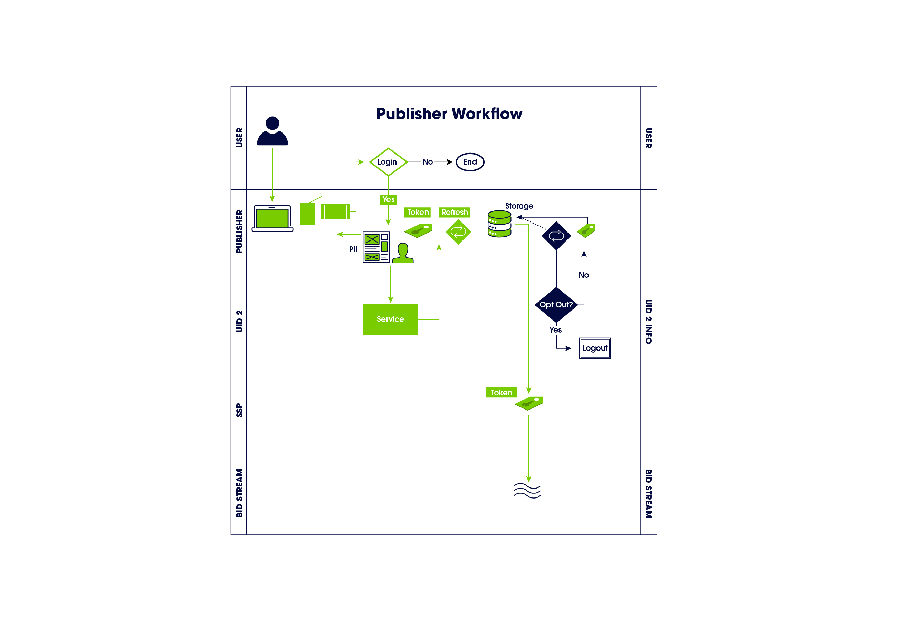

[UID2 Overview](../README-ja.md) > Supply-Side Workflow

# Supply-Side Workflow Overview

以下のステップは、ID プロバイダー、パブリッシャー、SSO プロバイダーなど、SSP を介して UID2 Token をビッドストリームに伝達する組織向けの、大まかなのワークフローの概要を示すものです。パブリッシャーは、SSO プロバイダーか、UID2 と相互運用可能な独立した ID プロバイダーのいずれかと連携することを選択できます。後者はパブリッシャーに代わって UID をインテグレーションすることができます。

1. ユーザーがパブリッシャーのウェブサイト、モバイルアプリ、または CTV アプリにアクセスします。
2. パブリッシャーがオープンインターネットの価値交換を説明し、ユーザーにログインをリクエストします。
3. ユーザーがログインすると、パブリッシャーは、SDK またはダイレクト API インテグレーションを通じて、ファーストパーティーの PII と対応するプライバシー設定を UID2 Operator に送信します。パブリッシャーは、SSO プロバイダーや ID プロバイダーに、PII とプライバシー設定の受け渡しを代行する権限を付与することもできます。
4. UID2 Operator は、ソルト化、ハッシュ化、暗号化処理を実行し、UID2 Token を返します。
5. パブリッシャーは UID2 Token を保存し、リアルタイム入札の際に SSP と共有します。
   - サーバーサイド: パブリッシャーは、トークンをマッピングテーブル、DMP、データレイク、その他のサーバーサイドアプリケーションに格納します。
   - クライアントサイド: パブリッシャーはトークンをクライアントサイドのアプリケーションまたはユーザーのブラウザにファーストパーティークッキーとして保存する。
6. パブリッシャーは、インプレッション時に UID2 Token を SSP に送信します。
7. SSP は UID2 Token を使って入札リクエストを行い、ビッドストリームに取り込みます。
8. パブリッシャーは Refresh Token を使用して UID2 Token の更新を要求します。オプトアウトされていれば、Refresh Token にはユーザーのオプトアウトリクエストが含まれます。

## Integrations

インテグレーションシナリオ、トークン管理、その他の詳細については、[Publisher Integration Guides](../api-ja/v2/guides/summary-guides.md) を参照してください。[Endpoints](../api-ja/v2/endpoints/summary-endpoints.md) も参照してください。

### Direct Integration Requirements

ユーザーの PII を送信して UID2 を生成したいパブリッシャーは、以下の要件を満たす必要があります。

- UID2 Operator API にアクセスできること。
- UID2 Operator API のインテグレーションを行い UID2 Token を生成すること。
- Refresh Token を維持する、または UID2 が提供する JavaScript client-side SDK を使用して Refresh Token を管理すること。
- UID2 Token を SSP やその他の統合組織に送信できるようにすること。

### Integration Through SSO or Identity Providers

パブリッシャー社は、UID2 と相互運用可能な SSO または独立系 ID プロバイダーと協力するもできます。プロバイダーは、UID2 インテグレーションを代行することができます。
