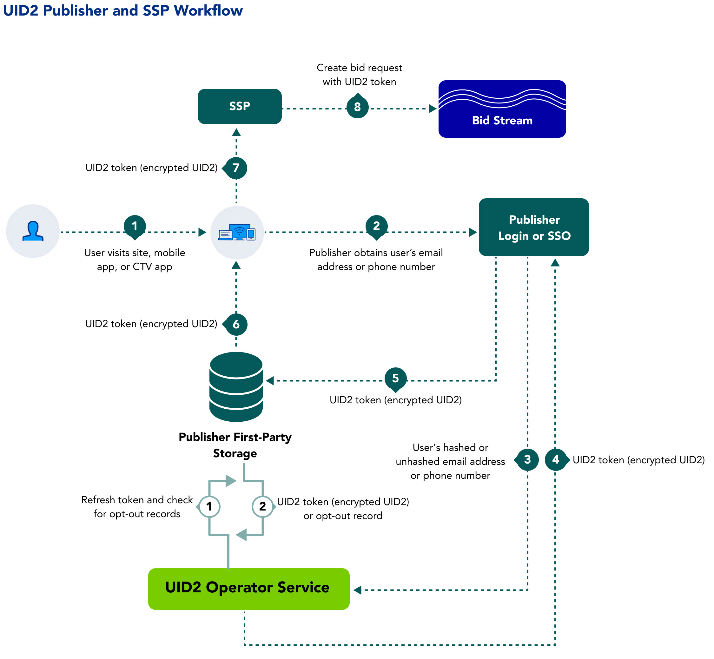

[UID2 Overview](../README-ja.md) > Publisher Workflow

# Publisher Workflow Overview

以下の手順は、ID プロバイダー、パブリッシャー、SSO プロバイダーなど、SSP を介して UID2 Token をビッドストリームに伝播する組織を対象としたワークフローの概要を示しています。パブリッシャーは、UID2 と相互運用可能で、パブリッシャーに代わって UID2 インテグレーションを処理できる SSO プロバイダーまたは独立した ID プロバイダーと連携することを選択できます。

1. ユーザーがパブリッシャーのウェブサイト、モバイルアプリ、または CTV アプリにアクセスします。
2. パブリッシャーがオープンなインターネットの価値交換を説明し、ログインなどで、メールアドレスや電話番号の提供を求めます。
3. ユーザーがログインすると、パブリッシャーが SDK または直接の API インテグレーションを通じて、UID2 Operator にメールアドレスまたは電話番号を送信します。

パブリッシャーは、SSO プロバイダーや ID プロバイダーに、DII やプライバシー設定を代理で渡すように承認できます。
4. UID2 Operator：
   - メールアドレスまたは電話番号を受け取ります。
   - ソルト、ハッシュ、および暗号化処理を実行します。
   - UID2 Token を返します。
5. パブリッシャーは UID2 Token を保存し、リアルタイム入札の際に SSP と共有します。
   - サーバーサイド: パブリッシャーは、トークンをマッピングテーブル、DMP、データレイク、その他のサーバーサイドアプリケーションに格納します。
   - クライアントサイド: パブリッシャーはトークンをクライアントサイドのアプリケーションまたはユーザーのブラウザにファーストパーティクッキーとして保存する。
6. パブリッシャーがストレージから UID2 Token を取得します。
7. パブリッシャーは UID2 トークンを SSP に送信します。
8. SSP は UID2 Token を含む入札要求をビッドストリームに投入した。

## Integrations

インテグレーションシナリオ、トークン管理、その他の詳細は、[Publisher Integration Guides](../api-ja/v2/guides/summary-guides.md) を参照してください。[Endpoints](../api-ja/v2/endpoints/summary-endpoints.md) も参照してください。

### Direct Integration Requirements

ユーザーの DII を送信して UID2 を生成したいパブリッシャーは、以下の要件を満たす必要があります。

- UID2 Operator API にアクセスできること。
- UID2 Operator API のインテグレーションを行い UID2 Token を生成すること。
- Refresh Token を維持する、または UID2 が提供する JavaScript client-side SDK を使用して Refresh Token を管理すること。
- UID2 Token を SSP やその他のインテグレーション組織に送信できるようにすること。

### Integration Through SSO or Identity Providers

パブリッシャー社は、UID2 と相互運用可能な SSO または独立系 ID プロバイダーと協力するもできます。プロバイダーは、UID2 インテグレーションを代行できます。

パブリッシャーは、UID2 と相互運用可能な SSO または独立系 ID プロバイダーと連携することを選択できます。プロバイダーは、UID2インテグレーションを代理で処理できます。