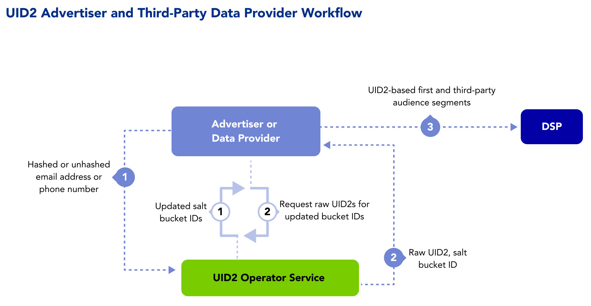

[UID2 Overview](../README.md) > Third-Party Data Provider Workflow

# Third-Party Data Provider Workflow Overview

The following steps provide a high-level outline of the workflow intended for organizations that collect user data and push it to DSPs—for example, advertisers, identity graph providers, and third-party data providers.

1. Data provider sends a user’s consented directly identifying information (DII) to the UID2 Operator.
2. UID2 Operator generates and returns a raw UID2.
3. Data provider stores the UID2 and salt bucket. 
   Server-side: The data provider stores the UID2 in a mapping table, DMP, data lake, or other server-side application.
4. Data provider sends the UID2 to a DSP using permitted transport protocols defined in the code of conduct.
5. Data provider monitors the UID2 Operator for rotated salt buckets and updates UID2s as needed.

## Integration Requirements

To generate UID2s from users' DII, third-party data providers must meet the following requirements:

- Integrate with a UID2 Operator to generate UID2s and handle salt bucket rotations.
- Have access to the UID2 Operator APIs. Some advertisers may choose to work through CDPs, data on-boarders, or other service providers instead.

For details, see [Advertiser and Third-party Data Provider Integration Guide](../api/v2/guides/advertiser-dataprovider-guide.md).
