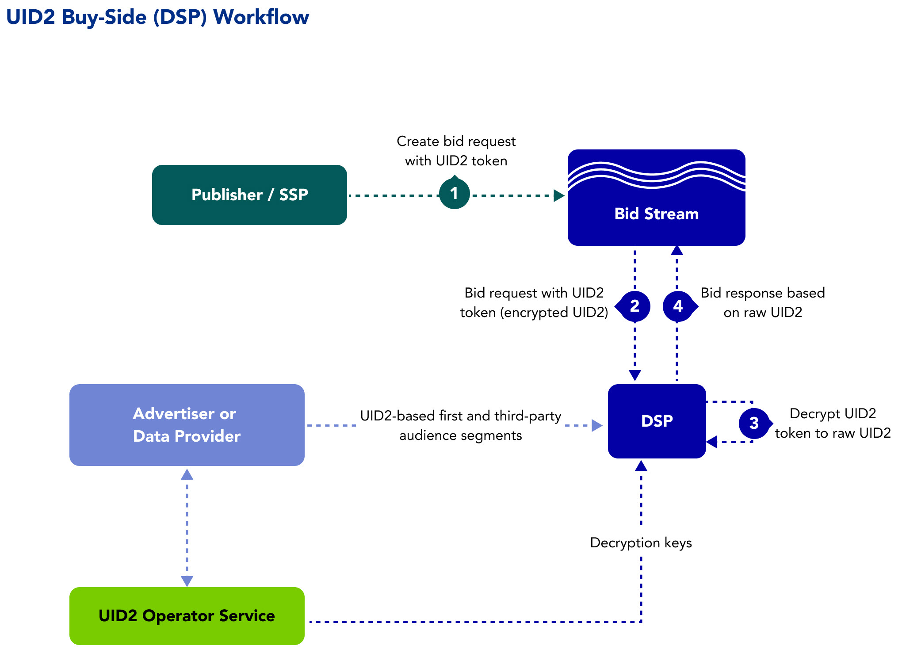

[UID2 Overview](../README.md) > Buy-Side Workflow

# Buy-Side Workflow Overview

The following steps provide a high-level outline of the workflow intended for demand-side platforms (DSPs) that transact on UID2s in the bid stream.

1. Data providers pass first-party and third-party data to DSPs in the form of raw UID2s.
2. DSPs sync with UID2 Administrator to receive decryption keys.
3. DSPs access UID2 tokens in the bid stream and decrypt them at bid time.
4. DSPs listen to opt-out requests from UID2 Administrator and block buying on any UID2 that has opted-out.

## Integration Requirements

To integrate with UID2 to receive UID2s from brands (as first-party data) and data providers (as third-party data) and leverage them to inform bidding on UID2s in the bid stream, the buy-side participants must meet the following requirements:

- Accept data in the form of UID2s
- Bid on data in the form of UID2s
- Build a webhook for honoring opt-out requests
- Sync encryption keys daily with the UID2 Administrator

For details, see [DSP Integration Guide](../api/v2/guides/dsp-guide.md).

Optionally, if a DSP wants to generate UID2s themselves from directly identifying information (DII), they can also follow the [Third-Party Data Provider Workflow](workflow-overview-3p-data-provider.md).
