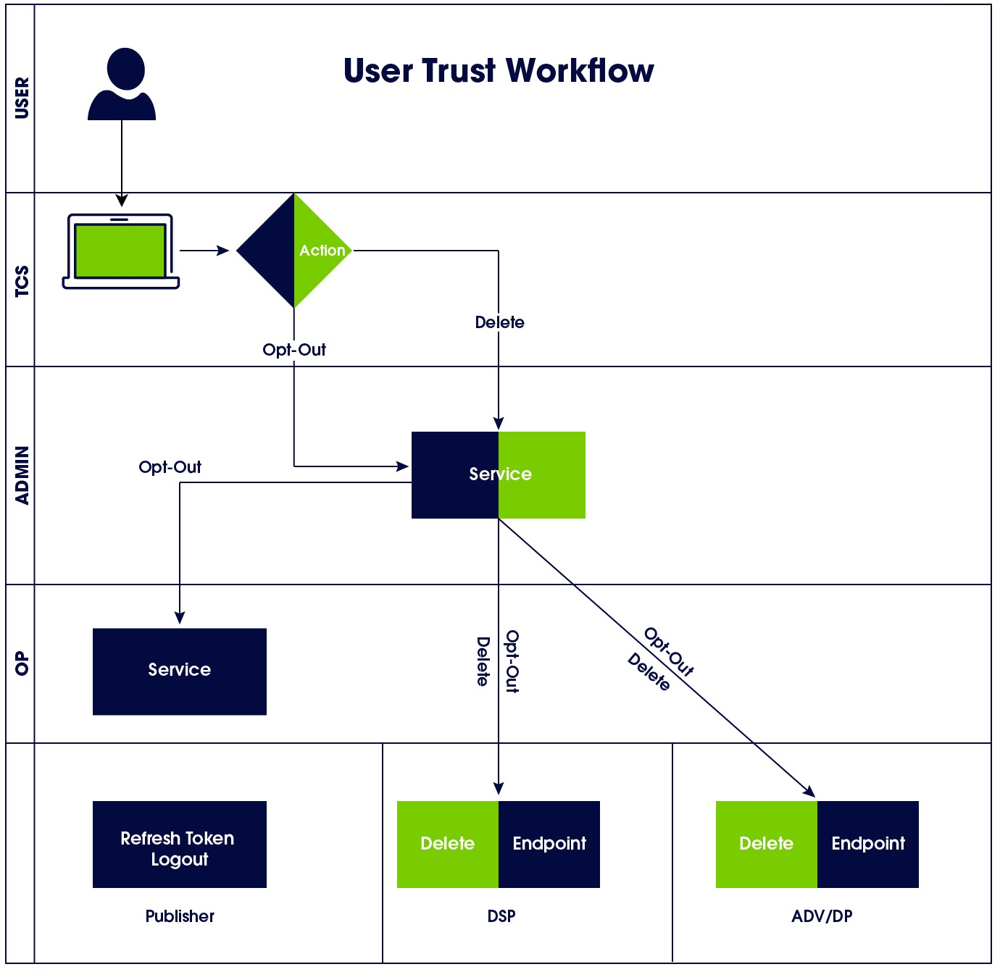

[UID2 Overview](../README.md) > Opt-Out Workflow

# Opt-Out Workflow Overview

The following steps provide a high-level outline of the workflow intended for users who engage with publishers or their identity providers. 

1. Users visit the Opt-Out Portal, where they can globally opt out of UID2 for all publishers.
2. Opt-out requests are sent to the UID2 Administrator.
3. UID2 Administrators distribute the request to DSPs.
4. UID2 Operators distribute the request to all publishers by means of the refresh token workflow.

This workflow allows a user to consent to the creation of a UID2 token and manage their UID2 consent and privacy settings through the [Transparency and Control Portal](https://transparentadvertising.org).

